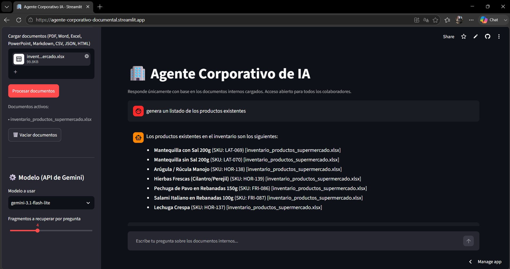

# Agente Corporativo de IA — Desafío Alura Agentes

Agente conversacional (RAG) que responde preguntas de los colaboradores
de una empresa hipotética con base **únicamente** en los documentos
internos que se cargan en la aplicación. Acceso abierto a cualquier
colaborador, sin restricciones.

> Proyecto desarrollado para el desafío **Alura Agentes**. En lugar de
> desplegar en Oracle Cloud Infrastructure (OCI), este proyecto se
> despliega en **Streamlit Community Cloud**.

## 📎 Demo desplegada

**URL de la app:** https://agente-corporativo-documental.streamlit.app

**Pantalla de inicio:**


**Ejemplo de pregunta respondida:**


## Contexto organizacional cubierto

El agente está pensado para dar soporte a preguntas sobre documentos de
cualquiera de estas áreas (no exhaustivo):

- Recursos Humanos (políticas, beneficios, onboarding)
- Financiero y Contable (estados de resultados, balances, políticas de gastos)
- Operacional (procesos, procedimientos, manuales técnicos)
- Estratégico (planes, roadmaps)
- Legal y Compliance (contratos, normativas de privacidad/protección de datos)
- Marketing y Comercial (pitch decks, tablas de precios)
- Datos y Sistemas (planillas, bases de clientes, APIs)
- Investigación y Desarrollo (market research, casos de negocio)
- Calidad (auditorías, planes correctivos)
- Comunicación Interna (comunicados, minutas, newsletters)

## Formatos de documento soportados

PDF · Word (.docx) · Excel (.xlsx/.xls) · PowerPoint (.pptx) · Markdown
(.md) · CSV · JSON · HTML

## Arquitectura (RAG)

1. **Ingesta**: se extrae el texto de cada documento según su formato
   (tablas de Excel/CSV se convierten a texto fila por fila; PowerPoint
   se extrae por diapositiva; HTML se limpia de etiquetas; JSON se
   serializa legible).
2. **Fragmentación**: el texto se divide en fragmentos (~900 caracteres,
   con solapamiento) para mejorar la precisión de la búsqueda.
3. **Embeddings**: cada fragmento se vectoriza localmente con un modelo
   multilingüe (`paraphrase-multilingual-MiniLM-L12-v2`, vía
   `sentence-transformers`), sin depender de una API externa para esta
   parte.
4. **Índice vectorial**: los vectores se almacenan en un índice
   **FAISS** en memoria de la sesión.
5. **Recuperación + generación**: ante cada pregunta, se buscan los `k`
   fragmentos más similares y se envían como contexto a la **API de
   Google Gemini** (capa gratuita), con instrucciones estrictas de
   responder solo con esa información y de indicar explícitamente
   cuando la respuesta no está en los documentos cargados.

### ¿Por qué Gemini y no un modelo local (Ollama) o la API de Claude?

La primera versión de este proyecto usaba un modelo local vía Ollama
para no depender de ninguna API externa. Sin embargo, el despliegue en
**Streamlit Community Cloud** no permite instalar ni ejecutar un
servicio como Ollama (no hay acceso a procesos en segundo plano ni a
modelos de varios GB), así que fue necesario usar una API en la nube.
Se eligió la **API de Gemini** en vez de la API de Claude porque
Google ofrece una capa gratuita sin necesidad de tarjeta de crédito,
suficiente para el uso del desafío. Los embeddings se siguen
calculando localmente en ambos casos.

## 1. Configurar la API key de Gemini (gratuita)

Obtén una API key gratuita en **Google AI Studio**
(https://aistudio.google.com/apikey) — no requiere tarjeta de crédito.
Luego configúrala de una de estas formas:

- **Variable de entorno:**
  ```bash
  export GEMINI_API_KEY="AIza..."
  ```
- **Archivo local de secrets** (no se sube a GitHub):
  ```bash
  cp .streamlit/secrets.toml.example .streamlit/secrets.toml
  # y edita el archivo con tu API key real
  ```
- **Desde la propia app**: si no se detecta la key, la barra lateral
  permite ingresarla manualmente (válida solo para esa sesión, no se
  guarda en ningún lado).

> La capa gratuita de Gemini tiene límites de solicitudes por minuto y
> por día (varían según el modelo). Para el uso normal de este
> desafío son más que suficientes; si necesitas más volumen, revisa los
> límites vigentes en https://ai.google.dev/gemini-api/docs/rate-limits

## 2. Instalar dependencias

```bash
python -m venv venv
source venv/bin/activate        # En Windows: venv\Scripts\activate
pip install -r requirements.txt
```

## 3. Ejecutar localmente

```bash
streamlit run app.py
```

## 4. Publicar el repositorio en GitHub

```bash
git init
git add .
git commit -m "Agente corporativo IA - Alura Agentes"
git branch -M main
git remote add origin https://github.com/<tu-usuario>/<tu-repo>.git
git push -u origin main
```

Asegúrate de que el repositorio sea **público** y de que
`.streamlit/secrets.toml` (con la API key real) **no** se suba — ya
está excluido en `.gitignore`.

## 5. Desplegar en Streamlit Community Cloud

1. Entra a https://share.streamlit.io e inicia sesión con GitHub.
2. Selecciona "New app" y elige el repositorio, la rama (`main`) y el
   archivo principal (`app.py`).
3. En **Advanced settings → Secrets**, agrega:
   ```toml
   GEMINI_API_KEY = "AIza..."
   ```
4. Despliega. Streamlit Cloud instalará automáticamente lo indicado en
   `requirements.txt`.
5. Copia la URL pública de la app y agrégala en la sección
   "Demo desplegada" de este README, junto con una captura de pantalla
   o video corto del agente respondiendo preguntas en producción (tal
   como pide el desafío).

## 6. Uso

1. En la barra lateral, sube uno o varios documentos internos y
   presiona **"Procesar documentos"**.
2. Elige el modelo de Gemini a usar.
3. Escribe tu pregunta en el chat. El agente solo responderá con
   información contenida en los documentos cargados, citando la fuente
   entre corchetes.
4. Cada respuesta incluye un panel expandible con los fragmentos de
   texto usados como contexto, para poder verificar la fuente.

## Notas y posibles extensiones

- **Persistencia del índice**: actualmente el índice FAISS vive en
  memoria de la sesión de Streamlit y se pierde al recargar la página.
  Puede extenderse guardándolo en disco (`faiss.write_index` + los
  fragmentos en un JSON/pickle) para no reprocesar los documentos en
  cada despliegue.
- **Control de acceso**: el desafío pide un agente abierto a todos los
  colaboradores, por lo que no se implementó autenticación. Si se
  quisiera restringir por área/rol en el futuro, se podría filtrar qué
  documentos se indexan por usuario.
- **Tamaño de fragmento / solapamiento**: ajustables en `app.py`
  (`CHUNK_SIZE`, `CHUNK_OVERLAP`).
